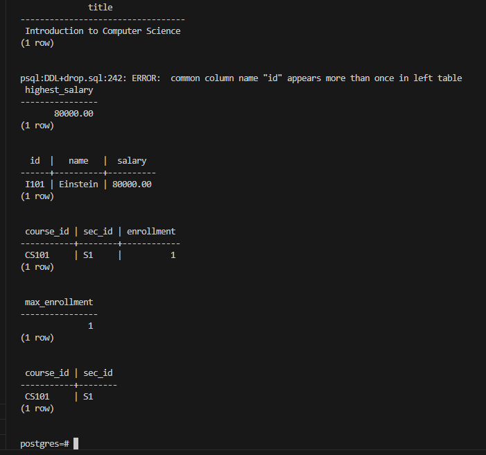

# E3.1DSC

Practice Exercises 3.1
a.
Find the titles of courses in the Comp. Sci. department that have 3 credits.

b.
Find the IDs of all students who were taught by an instructor named Einstein; make sure there are no duplicates in the result.

c.
Find the highest salary of any instructor.

d.
Find all instructors earning the highest salary (there may be more than one with the same salary).

e.
Find the enrollment of each section that was offered in Autumn 2009.

f.
Find the maximum enrollment, across all sections, in Autumn 2009.

g.
Find the sections that had the maximum enrollment in Autumn 2009.